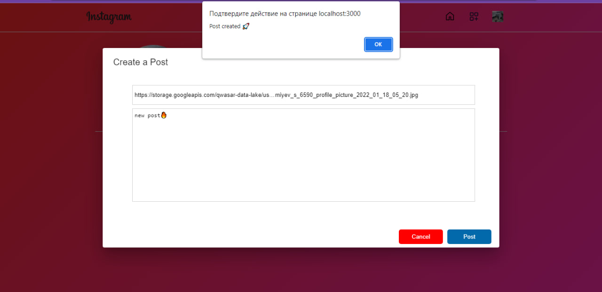

# Welcome to My Instagram
Welcome to My project Instagram

## Task
This project is about creating a clone of Instagram.

## Demo
https://shaxzod-instagram.netlify.app/

## Description
- Login,
- Signup,
- Follow, 
- Unfollow,
- Like, 
- Comment,
- Post Text, 
- Image,
- Shows images in Theatre mode,
- ...


## Installation
first you need install node. For install you need write in terminal
```
npm i
```
and write for run
```
npm start
```

## Usage
Tolqinov Elnur tolqinov_e 
```
./my_project argument1 argument2
```

## photos





### The Core Team


<span><i>Made at <a href='https://qwasar.io'>Qwasar SV -- Software Engineering School</a></i></span>
<span></span>
